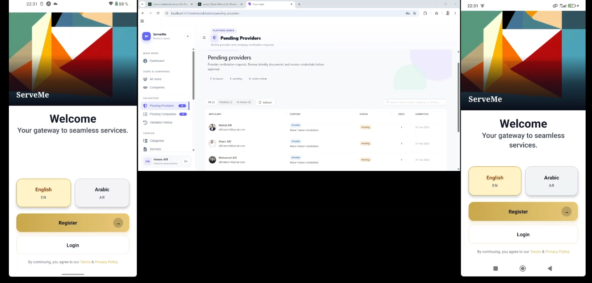

# ServeMe — On-Demand Services Marketplace

A full-stack platform connecting clients with local service providers and companies for home maintenance, cleaning, and repair services.

**PFE Project — Software Engineering**

---

# 📌 Project Overview

**ServeMe** is a full-stack **on-demand services marketplace** that connects **clients** with **independent service providers** and **companies** offering home and local services (maintenance, cleaning, repairs, and related categories).

The platform supports four main actors:

- **Clients** — search services, book appointments, message providers, and leave reviews
- **Independent service providers** — manage services, schedules, and client jobs
- **Companies / company administrators** — manage employees, services, orders, and operations
- **Platform admins** — manage users, catalog, validations, content, and platform activity

The system is organized as a **multi-application codebase**:

| Layer              | Description                                                            |
| ------------------ | ---------------------------------------------------------------------- |
| **Mobile app**     | React Native / Expo — clients, providers, and a subset of admin flows  |
| **Web dashboards** | React + Vite — platform admin and company admin                        |
| **Backend API**    | NestJS REST API — business logic, auth, persistence, search, messaging |
| **Database**       | PostgreSQL with **Prisma** ORM                                         |
| **Supabase**       | Authentication, file storage, and real-time broadcasts                 |
| **Redis**          | Caching and supporting infrastructure (see backend configuration)      |
| **AI chatbot**     | Python **FastAPI** microservice — natural-language service discovery   |

This README is a **high-level app overview**. Detailed setup, environment variables, and module documentation live in the linked READMEs and technical documentation below.

---

# 🎥 Project Demo

The demo showcases core workflows of the platform, including **authentication** and **appointment requests**, across the mobile and administration interfaces.

▶️ [](https://drive.google.com/file/d/1Tfcrcq81h7i59hyDBky5O0sCFbJgyvPK/view?usp=sharing)

---

# ✨ Main Features

### Client

- User registration and authentication (Supabase Auth)
- Service search
- Ratings and reviews on providers and companies
- Location-aware discovery (e.g. popular services nearby)
- Appointment requests and appointment lifecycle tracking
- Real-time messaging with providers
- In-app notifications
- Reviews and ratings
- Complaint submission with evidence (photos)
- **AI-powered natural-language service search**

### Provider

- Profile and settings management
- Service management
- Appointment and job management
- Schedule and availability management
- Client messaging
- Ratings and reviews visibility
- Dashboard and operational workflows on mobile

### Company Admin

- Company profile and settings management
- Employee management under the company
- Service management for company offerings
- Order and appointment management
- Schedule and capacity management
- Complaints and ratings management
- Company administration dashboard

### Platform Admin

- User management
- Company management
- Provider and document validation workflows
- Service management
- Appointment monitoring
- Complaint management
- Review moderation / management
- FAQs, terms & privacy policies management
- Support messages
- Chatbot session monitoring
- Platform activity logs

---

# 🏗️ System Architecture

```
                         ┌─────────────────────┐
                         │   React Native      │
                         │    Mobile App       │
                         │                     │
                         │ Client / Provider   │
                         │                     │
                         └──────────┬──────────┘
                                    │
                                    │ REST API / JWT
                                    ▼
                         ┌─────────────────────┐
                         │      NestJS         │
                         │     REST API        │
                         │                     │
                         │ Business Logic      │
                         │ Authentication      │
                         │ Appointments        │
                         │ Messaging           │
                         │ Reviews             │
                         │ Notifications       │
                         │ Search              │
                         └───────┬─────┬───────┘
                                 │     │
                    ┌────────────┘     └─────────────┐
                    ▼                                ▼
          ┌─────────────────┐              ┌─────────────────┐
          │   PostgreSQL    │              │    Supabase     │
          │                 │              │                 │
          │     Prisma      │              │ Auth / Storage  │
          │      ORM        │              │    Realtime     │
          └─────────────────┘              └─────────────────┘
                                 │
                                 │ AI Search (HTTP + shared secret)
                                 ▼
                         ┌─────────────────────┐
                         │   Python Chatbot    │
                         │      FastAPI        │
                         │                     │
                         │ OpenRouter          │
                         │ Embeddings          │
                         │ Vector Search       │
                         └─────────────────────┘

                         ┌─────────────────────┐
                         │      React + Vite   │
                         │   Web Dashboards    │
                         │                     │
                         │ Platform Admin      │
                         │ Company Admin       │
                         └─────────────────────┘
                                    │
                                    │ REST API / JWT
                                    ▼
                              (NestJS API)
```

---

# 🛠️ Technology Stack

| Component            | Technologies                                                         |
| -------------------- | -------------------------------------------------------------------- |
| Mobile               | React Native, Expo, TypeScript                                       |
| Web                  | React, Vite, TypeScript, Ant Design                                  |
| Backend              | NestJS, TypeScript                                                   |
| Database             | PostgreSQL                                                           |
| ORM                  | Prisma                                                               |
| Authentication       | Supabase Auth, JWT, Passport                                         |
| Storage              | Supabase Storage                                                     |
| Real-time            | Supabase Realtime                                                    |
| Cache                | Redis                                                                |
| API communication    | REST, Axios                                                          |
| AI                   | Python, FastAPI, OpenRouter, vector embeddings (Supabase / pgvector) |
| Internationalization | i18next (English / Arabic)                                           |

---

# 📂 Project Structure

```
on-demand-services-marketplace/
│
├── backend/
│   ├── prisma/
│   │   ├── schema.prisma
│   │   └── migrations/
│   ├── src/
│   │   ├── modules/
│   │   ├── config/
│   │   └── common/
│   └── README.md
│
├── mobile-front/
│   ├── src/
│   │   ├── screens/
│   │   ├── navigation/
│   │   ├── services/
│   │   ├── hooks/
│   │   └── components/
│   └── README.md
│
├── web-front/
│   ├── src/
│   │   └── features/
│   │       ├── admin/
│   │       └── company_admin/
│   └── README.md
│
├── chatbot/
│   ├── main.py
│   ├── requirements.txt
│   └── README.md
│
└── docs/
    ├── images/
    └── TECHNICAL_DOCUMENTATION.md
```

---

# 👥 User Roles

| Role               | Main responsibilities                                            |
| ------------------ | ---------------------------------------------------------------- |
| **CLIENT**         | Search services, request appointments, chat, review providers    |
| **PROVIDER**       | Manage services, schedule, appointments, and client interactions |
| **COMPANY_ADMIN**  | Manage company providers, services, orders, and schedules        |
| **PLATFORM_ADMIN** | Manage and monitor the overall platform                          |

---

# 🔌 Backend API

The backend exposes a **REST API** (NestJS) consumed by the mobile app, web dashboards, and the chatbot service.

| Module         | Description                                          |
| -------------- | ---------------------------------------------------- |
| Authentication | Registration completion, session user, authorization |
| Clients        | Client profiles and client-facing operations         |
| Providers      | Provider profiles, services, and dashboards          |
| Companies      | Company and employee management                      |
| Appointments   | Appointment lifecycle                                |
| Messaging      | Conversations and messages                           |
| Reviews        | Ratings and reviews                                  |
| Complaints     | Client complaints and evidence                       |
| Search         | Service and provider discovery                       |
| Notifications  | In-app notifications                                 |
| Chatbot        | AI-assisted service search (proxies Python service)  |
| Administration | Platform administration endpoints                    |

## For more details, see **[Backend README](backend/README.md)**.

# 🤖 AI Architecture

AI-assisted search is implemented as a **separate Python microservice** (FastAPI). The mobile app does not call OpenRouter directly; requests go through the NestJS API, which persists sessions and messages and forwards context to Python.

```
Client
   │
   ▼
React Native App
   │
   ▼
NestJS API  (JWT, sessions, catalog search bridge)
   │
   ▼
Python Chatbot Service
   │
   ├── OpenRouter
   │      └── LLM (intent, FAQ, conversational replies)
   │
   ├── Embedding model
   │      └── Query vectorization
   │
   └── Structured + vector search
          └── Catalog via NestJS; semantic match via pgvector (Supabase)
```

Users describe their needs in natural language; the service extracts intent, runs **structured catalog search** and optional **semantic search**, then returns a short reply plus a list of matching providers.

Implementation details: **[Chatbot README](chatbot/README.md)** and **[Technical Documentation](docs/TECHNICAL_DOCUMENTATION.md)**.

---

# 🗄️ Database & Infrastructure

- **PostgreSQL** — primary persistent data
- **Prisma** — schema, migrations, and type-safe data access (`backend/prisma/`)
- **Supabase Auth** — identity and JWT for users
- **Supabase Storage** — to store images, files, and documents
- **Supabase Realtime** — to implement a real-time notification and messaging system.
- **Redis** — for caching

---

# 🚀 Running the Project

Start the **backend** first, then mobile, web, and the chatbot.

## 1. Backend

Check **[Backend Quick Start](backend/QuickStart.md)**

## 2. Mobile

Check **[Mobile Quick Start](mobile-front/QuickStart.md)**

## 3. Web administration

Check **[Web Quick Start](web-front/QuickStart.md)**

## 4. AI chatbot

Check **[Chatbot README](chatbot/README.md)**

---

# 📚 Documentation

| Document                                                       | Purpose                                                        |
| -------------------------------------------------------------- | -------------------------------------------------------------- |
| **[Technical Documentation](docs/TECHNICAL_DOCUMENTATION.md)** | Architecture, environment setup, API overview, troubleshooting |
| **[Backend README](backend/README.md)**                        | API modules, Prisma, Supabase storage, scripts                 |
| **[Mobile README](mobile-front/README.md)**                    | Expo setup, roles, mobile structure                            |
| **[Web README](web-front/README.md)**                          | Admin and company routes, Vite setup                           |
| **[Chatbot README](chatbot/README.md)**                        | AI service setup, OpenRouter, embeddings                       |

The per-application READMEs contain detailed setup instructions, environment variables, scripts, routes, and application-specific technical information.

---

# 🎓 Project Context

**ServeMe** was developed as a **Projet de Fin d’Études (PFE)** in software engineering. It demonstrates the design and implementation of a **complete multi-application platform**, including:

- Mobile and web client development
- Backend API and modular domain design
- Relational database modeling and migrations
- Authentication and role-based authorization
- Real-time messaging and notifications
- File uploads and storage policies
- AI-assisted service discovery
- Automated and manual API validation during development

---

# 👨‍💻 My Contributions

Across this PFE, work spanned the **full stack** and integration between applications, including:

- **System design** — multi-app architecture (mobile, web, API, AI microservice) and clear separation of concerns
- **NestJS REST API** — feature modules (appointments, messaging, search, reviews, complaints, notifications, chatbot, admin)
- **Database** — PostgreSQL schema design and evolution with **Prisma** migrations
- **Security** — Supabase Auth, JWT validation, role-based access for client, provider, company, and platform admin flows
- **Client & provider journeys** — mobile screens for search, booking, messaging, and provider operations
- **Web administration** — platform and company dashboards (React + Vite + Ant Design)
- **Real-time & media** — Supabase Realtime and Storage integration for notifications, chat, and evidence uploads
- **AI service search** — Python chatbot with intent routing, catalog search, and vector-backed semantic matching
- **Quality** — backend unit tests (PostMan), API testing during development, and documented setup paths

---

# 👨‍💻 Project Author

**Hatem Afli**  
Software Engineer

This repository contains the implementation and technical documentation of the **ServeMe** PFE project.
