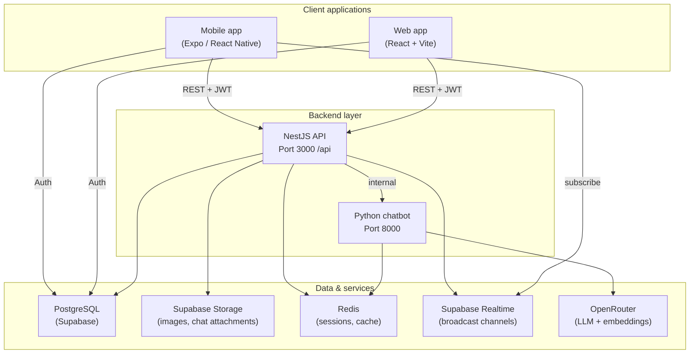

# On-Demand Services Marketplace — Technical Documentation

**Project type:** Internship / PFE — Full-stack marketplace for on-demand local services  
**Last updated:** July 2026

---

## Table of contents

1. [Executive summary](#1-executive-summary)
2. [System architecture](#2-system-architecture)
3. [Technology stack](#3-technology-stack)
4. [Repository structure](#4-repository-structure)
5. [Prerequisites](#5-prerequisites)
6. [External services](#6-external-services)
7. [Environment configuration](#7-environment-configuration)
8. [Installation & run guide](#8-installation--run-guide)
9. [User roles & applications](#9-user-roles--applications)
10. [Functional modules](#10-functional-modules)
11. [API overview](#11-api-overview)
12. [Database](#12-database)
13. [Real-time features](#13-real-time-features)
14. [Optional: AI chatbot](#14-optional-ai-chatbot)
15. [Testing & verification](#15-testing--verification)
16. [Troubleshooting](#16-troubleshooting)
17. [Security notes for supervisors](#17-security-notes-for-supervisors)

---

## 1. Executive summary

This platform connects **clients** who need local services with **independent providers** and **companies** that employ providers. It supports the full service lifecycle:

- User registration and role-based authentication
- Service catalog and provider profiles
- Search, favorites, and AI-assisted discovery (chatbot)
- Appointment booking with multi-step execution (confirm → en route → start → complete)
- In-app messaging with read receipts, edit, and withdraw
- Reviews, complaints, and notifications
- Platform administration and company management via web dashboards

The **mobile app** (React Native / Expo) is the primary client and provider interface. The **web app** serves **platform admins** and **company admins**. The **NestJS backend** is the single source of business logic and exposes a REST API under `/api`.

---

## 2. System architecture



### Authentication flow

1. Mobile or web signs up / logs in via **Supabase Auth** (email + password).
2. Supabase returns a JWT access token.
3. The client stores the token securely and sends it on every API call: `Authorization: Bearer <token>`.
4. NestJS validates the JWT, loads the user profile from PostgreSQL, and enforces **role-based access control** (RBAC).

---

## 3. Technology stack

| Layer             | Technology                      | Version (approx.) |
| ----------------- | ------------------------------- | ----------------- |
| Mobile            | React Native, Expo              | SDK 55            |
| Mobile navigation | React Navigation                | v7                |
| Web admin         | React, Vite, Ant Design         | React 19, Vite 8  |
| Backend API       | NestJS, TypeScript              | NestJS 11         |
| ORM               | Prisma                          | 6.x               |
| Database          | PostgreSQL (hosted on Supabase) | 15+               |
| Auth              | Supabase Auth + Passport JWT    | ES256             |
| Real-time         | Supabase Realtime (broadcast)   | —                 |
| Cache / sessions  | Redis (ioredis)                 | 7+                |
| AI chatbot        | Python, FastAPI, OpenRouter     | —                 |
| Email             | Resend (transactional)          | —                 |
| Maps (mobile)     | react-native-maps, Google Maps  | —                 |
| i18n (mobile)     | i18next                         | EN / AR           |

---

## 4. Repository structure

```
on-demand-services-marketplace/
├── backend/                 # NestJS REST API
│   ├── prisma/
│   │   ├── schema.prisma    # Database models
│   │   └── migrations/      # SQL migrations
│   ├── src/
│   │   ├── modules/         # Feature modules (auth, appointments, messaging…)
│   │   ├── config/          # Prisma, Redis, Supabase
│   │   └── common/          # Guards, decorators, middleware
│   └── .env.example
│
├── mobile-front/            # Expo mobile app (clients, providers, mobile admin)
│   ├── src/
│   │   ├── screens/         # UI screens per role
│   │   ├── navigation/      # Stack / tab navigators
│   │   ├── services/        # API client (axios)
│   │   └── hooks/           # Realtime, auth helpers
│   └── app.json
│
├── web-front/               # Web dashboards (platform admin + company admin)
│   └── src/features/
│       ├── admin/           # Platform administration
│       └── company_admin/   # Company management
│
├── chatbot/                 # Python AI microservice (optional for demo)
│   ├── main.py
│   └── requirements.txt
│
└── docs/
    └── TECHNICAL_DOCUMENTATION.md   # This file
```

---

## 5. Prerequisites

Install the following on the supervisor’s machine:

| Tool                                        | Minimum version          | Purpose              |
| ------------------------------------------- | ------------------------ | -------------------- |
| **Node.js**                                 | 18+ (20 LTS recommended) | Backend, mobile, web |
| **npm**                                     | 9+                       | Package management   |
| **Git**                                     | 2.x                      | Clone repository     |
| **Expo Go** (phone) or Android/iOS emulator | Latest                   | Run mobile app       |
| **Python**                                  | 3.10+                    | Chatbot (optional)   |
| **Docker** (optional)                       | Any recent               | Run Redis locally    |

**Recommended for mobile testing on a physical device:** phone and development PC on the **same Wi‑Fi network**.

---

## 6. External services

The project relies on a **Supabase project** (provided by the intern or created for the demo). Required Supabase features:

- PostgreSQL database
- Authentication (email provider)
- Storage buckets (profile images, chat attachments, verification documents)
- Realtime (enabled for broadcast channels)

**Redis** is required for chatbot sessions and caching. Run locally:

```bash
docker run -d --name serveme-redis -p 6379:6379 redis:7-alpine
```

**OpenRouter** API key is only needed if demonstrating the AI chatbot.

---

## 7. Environment configuration

### 7.1 Backend — `backend/.env`

Copy from `backend/.env.example`:

```env
# Database (Supabase PostgreSQL)
DATABASE_URL="postgresql://postgres.[REF]:[PASSWORD]@[HOST]:6543/postgres?pgbouncer=true&connection_limit=1"
DIRECT_URL="postgresql://postgres.[REF]:[PASSWORD]@[HOST]:5432/postgres"

# Supabase
SUPABASE_URL=https://[PROJECT].supabase.co
SUPABASE_ANON_KEY=
SUPABASE_SERVICE_ROLE_KEY=
SUPABASE_JWT_SECRET=

# Application
PORT=3000
NODE_ENV=development

# JWT (application-level, if used)
JWT_SECRET=
JWT_EXPIRATION=7d

# Redis
REDIS_URL=redis://localhost:6379

# Chatbot integration (optional)
CHATBOT_URL=http://localhost:8000
NESTJS_CHATBOT_SECRET=serveme-chatbot-secret-2026
CHATBOT_SESSION_TTL_DAYS=90
```

> **Important:** Never commit `.env` files. Share secrets with the supervisor through a secure channel (password manager, private message), not in Git.

### 7.2 Mobile — `mobile-front/.env`

```env
EXPO_PUBLIC_SUPABASE_URL=https://[PROJECT].supabase.co
EXPO_PUBLIC_SUPABASE_ANON_KEY=[ANON_KEY]

# Optional — auto-detected from Metro LAN IP if unset
# EXPO_PUBLIC_API_URL=http://192.168.1.10:3000/api

EXPO_PUBLIC_APP_NAME="Service Platform"
EXPO_PUBLIC_APP_VERSION="1.0.0"
EXPO_PUBLIC_GOOGLE_MAPS_API_KEY=[GOOGLE_MAPS_KEY]
```

### 7.3 Web — `web-front/.env`

```env
VITE_SUPABASE_URL=https://[PROJECT].supabase.co
VITE_SUPABASE_ANON_KEY=[ANON_KEY]
VITE_API_URL=http://localhost:3000/api
```

### 7.4 Chatbot — `chatbot/.env` (optional)

See `chatbot/.env.example` and `chatbot/README.md`.

---

## 8. Installation & run guide

### Step 1 — Clone the repository

```bash
git clone https://gitlab.quickyprime.com/quicky-prime-interns/on-demand-services-marketplace.git
cd on-demand-services-marketplace
```

### Step 2 — Backend API

```bash
cd backend
npm install
cp .env.example .env
# Edit .env with Supabase credentials (see section 7.1)

npx prisma generate
npx prisma migrate deploy

npm run start:dev
```

**Expected output:** `Server is running on: http://localhost:3000/api`

Verify: open `http://localhost:3000/api` in a browser (health/root response).

### Step 3 — Mobile app

```bash
cd mobile-front
npm install
cp .env.example .env
# Edit .env with Supabase anon key and URL

npx expo start
```

- Press **`a`** for Android emulator, **`i`** for iOS simulator, or scan the QR code with **Expo Go** on a phone.
- On a **physical device**, ensure the backend is reachable at `http://<YOUR_PC_LAN_IP>:3000/api`. The app auto-detects the Metro bundler IP; if needed, set `EXPO_PUBLIC_API_URL` explicitly.

### Step 4 — Web admin (optional)

```bash
cd web-front
npm install
cp .env.example .env
# Edit .env

npm run dev
```

Open `http://localhost:5173` and log in with a **PLATFORM_ADMIN** or **COMPANY_ADMIN** account.

### Step 5 — Redis (recommended)

```bash
docker run -d --name serveme-redis -p 6379:6379 redis:7-alpine
```

Restart the backend after Redis is up.

### Step 6 — Chatbot (optional demo)

```bash
cd chatbot
python -m venv .venv
# Windows:
.\.venv\Scripts\activate
# macOS/Linux:
source .venv/bin/activate

pip install -r requirements.txt
cp .env.example .env
# Add OPENROUTER_API_KEY

uvicorn main:app --reload --port 8000
```

Run `backend/sql/chatbot_embeddings.sql` once in the Supabase SQL editor if semantic search is empty.

---

## 9. User roles & applications

| Role               | Application                    | Main capabilities                                                        |
| ------------------ | ------------------------------ | ------------------------------------------------------------------------ |
| **CLIENT**         | Mobile                         | Browse services, book appointments, chat, reviews, complaints, AI search |
| **PROVIDER**       | Mobile                         | Manage services, calendar, appointments, messaging, earnings dashboard   |
| **COMPANY_ADMIN**  | Web (+ mobile company screens) | Manage company providers, services, orders, schedule                     |
| **PLATFORM_ADMIN** | Web (+ mobile admin screens)   | User validation, catalog, appointments, complaints, FAQ, audit logs      |

### Account statuses

| Status      | Meaning                                           |
| ----------- | ------------------------------------------------- |
| `ACTIVE`    | Full access                                       |
| `PENDING`   | Awaiting admin validation (providers / companies) |
| `REJECTED`  | Registration denied                               |
| `SUSPENDED` | Temporarily blocked                               |
| `DELETED`   | Soft-deleted                                      |

### Demo accounts

Ask the intern for test credentials, or create users via Supabase Auth + complete registration in the app. Typical test matrix:

| Role           | How to obtain                                                                    |
| -------------- | -------------------------------------------------------------------------------- |
| Client         | Sign up in mobile app → complete client profile → immediately active             |
| Provider       | Sign up as provider → upload documents → admin approves in web dashboard         |
| Platform admin | Pre-seeded in database or created manually in Supabase + `platform_admins` table |

---

## 10. Functional modules

### Mobile app (`mobile-front`)

| Module                   | Description                                                          |
| ------------------------ | -------------------------------------------------------------------- |
| **Authentication**       | Sign up, OTP/email verification, password reset, profile completion  |
| **Client home & search** | Categories, nearby popular services, search history                  |
| **Service details**      | Provider profile, pricing, gallery, book appointment                 |
| **Appointments**         | List, detail, reschedule, confirm start/end, live status stepper     |
| **Messaging**            | Client ↔ provider chat, photos, sent/delivered/read, edit & withdraw |
| **Reviews**              | Leave, edit, remove reviews after completed jobs                     |
| **Complaints**           | File complaints with photos against appointments                     |
| **Chatbot**              | Natural-language service discovery (requires chatbot service)        |
| **Provider dashboard**   | Jobs, schedule, days off, service management, verification           |
| **Notifications**        | In-app notification center with unread counts                        |
| **Settings**             | Profile, password, email, phone, delete account                      |
| **i18n**                 | English and Arabic                                                   |

### Web app (`web-front`)

| Area           | Routes (prefix)                                                                                                                                        |
| -------------- | ------------------------------------------------------------------------------------------------------------------------------------------------------ |
| Platform admin | `/admin/dashboard`, users, validations, catalog, appointments, complaints, reviews, FAQ, legal docs, support messages, chatbot sessions, activity logs |
| Company admin  | `/company/dashboard`, providers, services, orders, schedule, complaints, ratings, settings                                                             |

### Backend modules (`backend/src/modules`)

Core domains: `auth`, `clients`, `providers`, `companies`, `appointments`, `messaging`, `reviews`, `complaints`, `notifications`, `search`, `favorites`, `availability`, `given-service`, `verification`, `chatbot`, `faq`, `support-messages`, `platform-audit`, `platform-activity-logs`.

---

## 11. API overview

- **Base URL:** `http://localhost:3000/api`
- **Auth header:** `Authorization: Bearer <supabase_jwt>`
- **Validation:** Global `ValidationPipe` (class-validator DTOs)

### Representative endpoints

| Method | Path                          | Roles            | Description                          |
| ------ | ----------------------------- | ---------------- | ------------------------------------ |
| POST   | `/auth/complete-registration` | Any              | Create profile after Supabase signup |
| GET    | `/auth/me`                    | Any              | Current user profile                 |
| GET    | `/clients/me/home`            | CLIENT           | Home feed data                       |
| GET    | `/search/given-services`      | CLIENT           | Search services                      |
| POST   | `/appointments`               | CLIENT           | Create booking                       |
| PATCH  | `/appointments/:id/respond`   | PROVIDER         | Accept / decline                     |
| GET    | `/messaging/conversations`    | CLIENT, PROVIDER | Conversation list                    |
| POST   | `/messaging/messages`         | CLIENT, PROVIDER | Send message                         |
| PATCH  | `/messaging/messages/read`    | CLIENT, PROVIDER | Mark conversation read               |
| PATCH  | `/messaging/messages/:id`     | CLIENT, PROVIDER | Edit own message                     |
| DELETE | `/messaging/messages/:id`     | CLIENT, PROVIDER | Withdraw message                     |
| POST   | `/reviews`                    | CLIENT           | Submit review                        |
| GET    | `/admin/users`                | PLATFORM_ADMIN   | List users                           |
| GET    | `/company/dashboard`          | COMPANY_ADMIN    | Company overview                     |

All routes are protected by default unless marked `@Public()`.

---

## 12. Database

- **ORM:** Prisma — schema in `backend/prisma/schema.prisma`
- **Migrations:** `backend/prisma/migrations/`

### Common commands

```bash
cd backend

# Apply pending migrations (production / demo setup)
npx prisma migrate deploy

# Open visual database browser
npx prisma studio

# Seed FAQ (optional)
npm run db:seed:faq

# Seed sample providers (optional)
npm run db:seed:providers
```

### Key entities

`User`, `Client`, `Provider`, `Company`, `CompanyAdmin`, `PlatformAdmin`, `Service`, `ServiceCategory`, `GivenService`, `Appointment`, `Conversation`, `Message`, `Review`, `Complaint`, `Notification`, `FaqEntry`, `ChatbotConversation`.

---

## 13. Real-time features

Supabase Realtime **broadcast** channels (server → clients):

| Channel                  | Event                                                                    | Used for                             |
| ------------------------ | ------------------------------------------------------------------------ | ------------------------------------ |
| `conversation:{id}`      | `new_message`, `messages_status`, `message_updated`, `message_withdrawn` | Live chat                            |
| `notifications:{userId}` | `new_notification`                                                       | Notification badge                   |
| `appointment:{id}`       | `appointment_updated`                                                    | Appointment status on detail screens |

The backend publishes via `SupabaseRealtimeService` using the **service role key**.

---

## 14. Optional: AI chatbot

**Purpose:** Help clients find services using natural language and semantic search over the service catalog.

**Flow:** Mobile → `POST /api/chatbot/chat` (JWT) → NestJS → Python `/chat` → OpenRouter LLM + vector search → NestJS catalog API.

**Requirements:** Redis, OpenRouter API key, embeddings table (`backend/sql/chatbot_embeddings.sql`).

See `chatbot/README.md` for full setup.

---

## 15. Testing & verification

### Quick smoke test checklist

- [ ] Backend responds at `http://localhost:3000/api`
- [ ] Mobile app loads login screen without Supabase config errors
- [ ] Client can sign up, log in, and see home screen
- [ ] Provider can view schedule / appointments (with test account)
- [ ] Web admin login at `http://localhost:5173/login`
- [ ] Send a chat message between client and provider — status shows Sent → Read
- [ ] Create an appointment and step through provider status updates

### Backend tests

```bash
cd backend
npm test          # Unit tests
npm run test:e2e  # End-to-end (requires test DB)
```

---

## 16. Troubleshooting

| Problem                       | Solution                                                                                 |
| ----------------------------- | ---------------------------------------------------------------------------------------- |
| Mobile cannot reach API       | Use PC LAN IP in `EXPO_PUBLIC_API_URL`; disable firewall on port 3000; ensure same Wi‑Fi |
| `EPERM` on `prisma generate`  | Stop the running backend (`npm run start:dev`), then run `npx prisma generate`           |
| Supabase auth errors          | Verify `EXPO_PUBLIC_SUPABASE_*` / `VITE_SUPABASE_*` match the project                    |
| 401 on API calls              | Token expired — log out and log in; check `SUPABASE_JWT_SECRET` on backend               |
| Chatbot returns empty results | Run embeddings SQL; ensure given services are active; check OpenRouter key               |
| Redis connection refused      | Start Redis container; set `REDIS_URL` in backend `.env`                                 |
| Android emulator API          | Uses `10.0.2.2:3000` automatically via `resolveApiBaseUrl.ts`                            |

---
